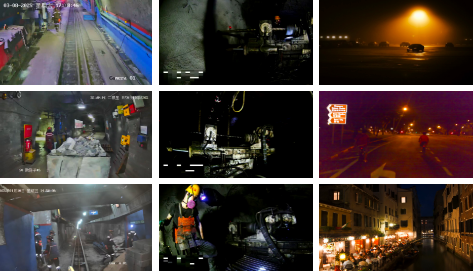
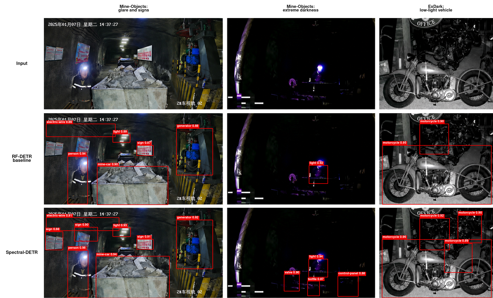

# Spectral-DETR

<p align="center">
  <b>Learnable Frequency Decomposition with Adaptive Contrastive Regularization for Robust Underground Mine Detection</b>
</p>

<p align="center">
  <a href="https://doi.org/10.3390/jimaging12090401">Paper</a> •
  <a href="https://github.com/songyuexin666-wq/mine-datasets">Dataset</a> •
  <a href="https://github.com/songyuexin666-wq/Spectral-DETR">Code</a>
</p>

> **Spectral-DETR: Learnable Frequency Decomposition with Adaptive Contrastive Regularization for Robust Underground Mine Detection**  
> Yuexin Song, Lukang Dai, Xinqi Xu, Jun Yang  
> *Journal of Imaging*, 2026, 12(9), 401  
> DOI: [10.3390/jimaging12090401](https://doi.org/10.3390/jimaging12090401)

**Spectral-DETR** is a detector-internal reliability framework built on **RF-DETR** for robust object detection in degraded underground mine scenes. It addresses low illumination, motion blur, dust scattering, and repetitive tunnel clutter through a cross-stage reliability pathway spanning **feature representation, decoder queries, and localization refinement**.



---

## Highlights

- **DAFD — Degradation-Aware Frequency Decomposition**  
  Performs learnable multi-band frequency decomposition with scene-adaptive modulation and gating to improve feature reliability under degradation.

- **DQCD — Degradation-Adaptive Query Contrastive Denoising**  
  Applies supervised contrastive regularization to decoder queries, with the contrastive temperature modulated by DAFD reliability statistics.

- **SCU + LUE — Salience-Calibrated Uncertainty with Learned Uncertainty Estimation**  
  Predicts coordinate-level uncertainty and uses salience-aware precision weighting to improve localization, especially for small and medium objects.

- **Detector-internal robustness**  
  No separate image-enhancement network is required.

- **Training-only regularization**  
  DQCD and SCU introduce no additional inference cost.

---

## Method Overview

Underground imagery is commonly affected by:

- low illumination and severe contrast variation;
- motion blur and camera vibration;
- dust or smoke scattering;
- repetitive tunnel backgrounds;
- weak boundaries and small-object localization difficulty.

Spectral-DETR models these challenges as a **cross-stage reliability propagation problem**:

1. **Feature reliability — DAFD**  
   Backbone features are decomposed into learnable frequency bands, adaptively modulated, and fused before multi-scale projection.

2. **Query reliability — DQCD**  
   Decoder-query representations are regularized using degradation-adaptive contrastive learning to improve foreground/background separability.

3. **Localization reliability — SCU + LUE**  
   Coordinate-level uncertainty is calibrated by geometric salience and used to precision-weight localization supervision.



---

## Main Results

### Mine-Objects

Mine-Objects is our self-built underground mine dataset containing **3,081 images and 14 object categories**.

| Evaluation setting | AP@0.5 | AP@0.5:0.95 |
| --- | ---: | ---: |
| RF-DETR controlled baseline | 0.883 | 0.472 |
| Spectral-DETR controlled validation | **0.913** | **0.486** |
| Spectral-DETR dataset-specific evaluation | **0.917** | **0.493** |

Under the dataset-specific evaluation protocol, Spectral-DETR exceeds YOLOv9m by **1.6 percentage points in AP@0.5** and **0.8 percentage points in AP@0.5:0.95**.

### Cross-Dataset Evaluation

| Dataset | AP@0.5 | AP@0.5:0.95 |
| --- | ---: | ---: |
| Mine-Objects | **0.917** | **0.493** |
| ExDark | **0.848** | **0.571** |
| ScienceDB Mine | **0.973** | **0.495** |

For complete experimental protocols, ablations, coupling controls, and implementation details, please refer to the published paper.

---

## Dataset

### Mine-Objects

Repository: [songyuexin666-wq/mine-datasets](https://github.com/songyuexin666-wq/mine-datasets)

- **Images:** 3,081
- **Classes:** 14
- **Scenes:** real underground mine roadways
- **Typical degradations:** low light, blur, dust, and complex clutter

The 14 categories are:

`person`, `redlight`, `light`, `port`, `sign`, `warn`, `gear`, `car`, `mine-car`, `ele-warn`, `camera`, `generator`, `annihilator`, and `electric-wire`.

### ScienceDB Mine

The Coal Mine Underground Drilling Site Object Detection Dataset is used as an additional mine-domain benchmark.

- DOI: [10.57760/sciencedb.j00001.01020](https://doi.org/10.57760/sciencedb.j00001.01020)

### ExDark

ExDark is used to evaluate robustness under extremely low-light conditions.

- Dataset: [Exclusively-Dark-Image-Dataset](https://github.com/cs-chan/Exclusively-Dark-Image-Dataset)

---

## Installation

### Clone the repository

```bash
git clone https://github.com/songyuexin666-wq/Spectral-DETR.git
cd Spectral-DETR
```

### Install dependencies

Python >= 3.9 is recommended. Install a PyTorch/CUDA combination suitable for your hardware first.

```bash
pip install -r requirements.txt
```

---

## Training

Prepare the dataset in COCO style and update the dataset path in the YAML configuration.

Example:

```yaml
dataset:
  dataset_file: "coco"
  coco_path: "/path/to/mine-datasets"
```

Example configurations:

- `configs/baseline.yaml` — RF-DETR baseline.
- `configs/lue_fafd_qcd.yaml` — full Spectral-DETR configuration.

> The repository keeps the historical configuration filename for compatibility. The terminology used in the published paper is **DAFD / DQCD / SCU+LUE**.

Run training with:

```bash
# RF-DETR baseline
python3 train_mine.py --config configs/baseline.yaml

# Full Spectral-DETR
python3 train_mine.py --config configs/lue_fafd_qcd.yaml
```

---

## Inference

A minimal single-image inference workflow:

```python
import torch
from PIL import Image
from rfdetr import RFDETRBase

model = RFDETRBase()
model.load_state_dict(
    torch.load("/path/to/spectral_detr_mineobjects.pth", map_location="cpu")
)
model.eval()

image = Image.open("/path/to/your_image.jpg").convert("RGB")
detections = model.predict(image, threshold=0.5)

for cls_id, conf, box in zip(
    detections.class_id,
    detections.confidence,
    detections.bbox,
):
    print(cls_id, conf, box)
```

---

## Relationship to RF-DETR

This repository extends [RF-DETR](https://github.com/roboflow/rf-detr) with detector-internal reliability modeling for degraded underground scenes. The main additions include:

- degradation-aware frequency-domain feature processing;
- degradation-adaptive decoder-query contrastive regularization;
- salience-calibrated localization uncertainty modeling;
- mine-specific datasets, configurations, diagnostics, and evaluation utilities.

For the original detector architecture and general RF-DETR features, please refer to the official RF-DETR repository.

---

## Citation

If you find this project or the Mine-Objects dataset useful, please cite:

```bibtex
@article{song2026spectraldetr,
  title   = {Spectral-DETR: Learnable Frequency Decomposition with Adaptive Contrastive Regularization for Robust Underground Mine Detection},
  author  = {Song, Yuexin and Dai, Lukang and Xu, Xinqi and Yang, Jun},
  journal = {Journal of Imaging},
  volume  = {12},
  number  = {9},
  pages   = {401},
  year    = {2026},
  doi     = {10.3390/jimaging12090401}
}
```

---

## Acknowledgements

This work was developed by **Yuexin Song**, **Lukang Dai**, **Xinqi Xu**, and **Jun Yang**.

The implementation builds on excellent open-source research including:

- [RF-DETR](https://github.com/roboflow/rf-detr)
- DINOv2
- Deformable DETR
- related DETR-family detection frameworks

We thank the authors and maintainers of these projects for making their work publicly available.

---

## License

This repository is released under the **MIT License**. See [LICENSE](LICENSE) for details.
